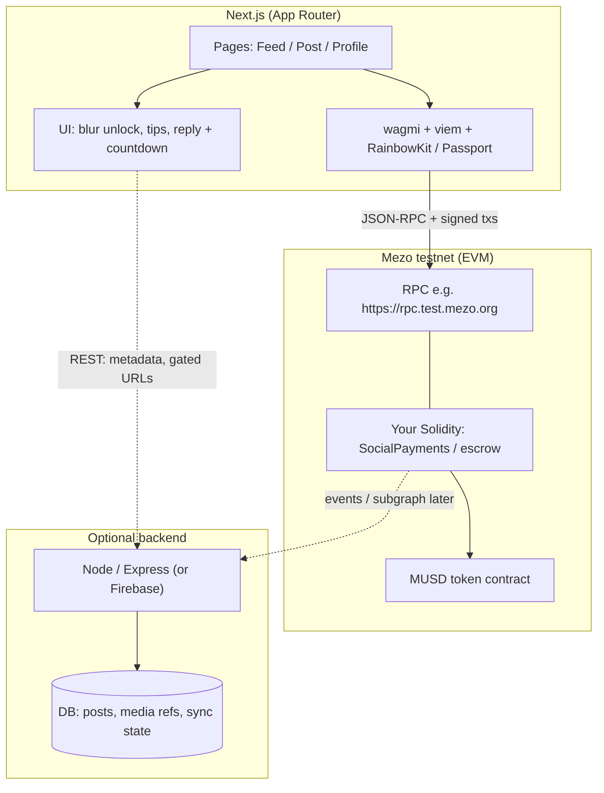
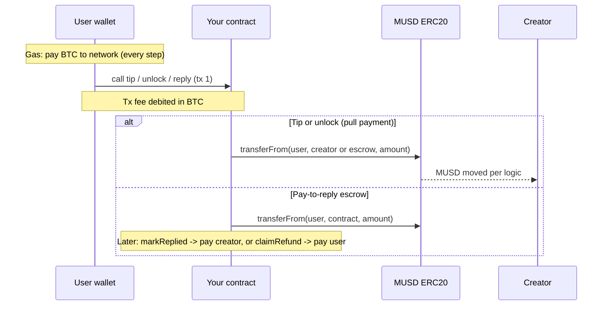
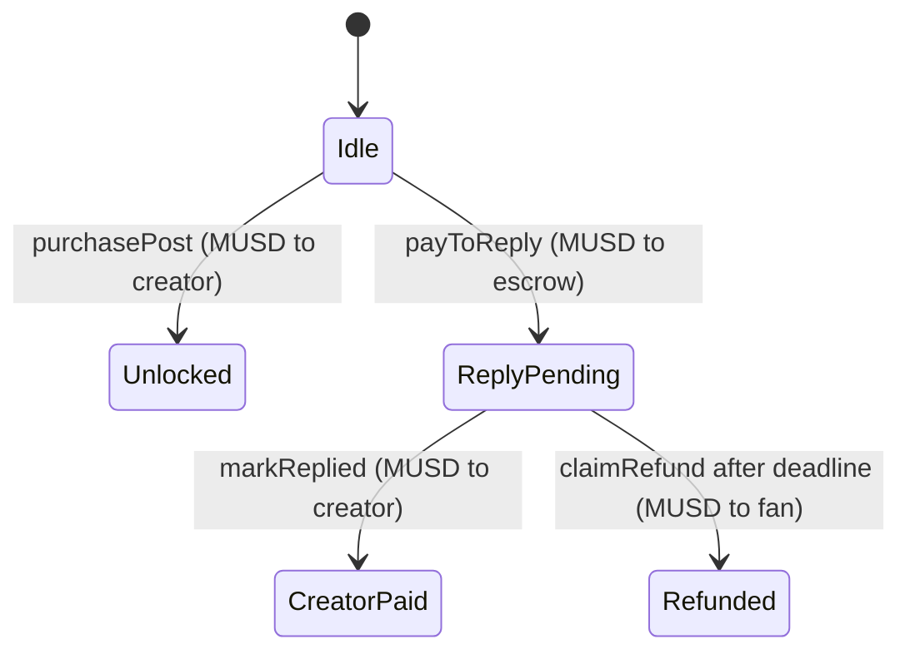
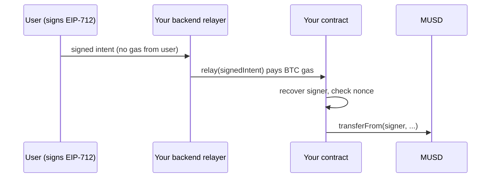

# MUSD Pay-to-Interact Social — Architecture

This document is the **planning reference** for the hackathon app: how pieces fit together, and how **Mezo gas** relates to **MUSD payments**.

---

## 1. Mezo: what pays for gas vs what pays creators

Mezo is **EVM-compatible**. Wallets and contracts work like Ethereum, but the **native network asset** is not MUSD.

| Concept | Role on Mezo | Used for |
| -------- | ------------- | -------- |
| **Native currency (BTC)** | Listed in official docs as the chain’s **native currency** (18 decimals on testnet/mainnet configs). | **Transaction fees (gas)** for every transaction: transfers, contract calls, approvals. |
| **MUSD** | Ecosystem **stablecoin** (Bitcoin-backed design per Mezo/MUSD docs). Behaves like an **ERC-20 style** token in your app. | **Your product logic**: unlock post, tip “like”, pay-to-reply escrow, refunds in MUSD. |

So:

- **Gas is paid in the chain’s native asset (BTC on Mezo)**, not in MUSD.
- **MUSD is not “the gas token.”** Users still need enough **BTC** (test BTC on testnet) to **submit** the transaction that moves or escrows MUSD.
- There is no need to invent a separate “Mezo token for gas” in the mental model: **Mezo documents describe BTC as the native currency for fees**, and **MUSD as the stablecoin layer** for apps and DeFi.

**Practical UX for your hackathon:**

1. User gets **test BTC** from the official faucet (for gas).
2. User obtains **MUSD** however the hackathon / testnet setup provides (faucet, swap, or scripted mint if available in your environment).
3. User may need to **approve** your contract to spend MUSD (`approve` / `permit`), then call your contract; **both steps cost gas in BTC**.

```text
  User wallet
  ├── BTC balance     → pays validators for gas on each tx
  └── MUSD balance    → pays creators / your contract for product actions
```

---

## 2. High-level system architecture

End-to-end view: **Next.js** talks to **Mezo** via the wallet; optional **Node** indexes events and serves gated content metadata.



**ASCII (for quick copy or tools without Mermaid):**

```text
+------------------+       signed txs        +-------------------------+
|   Next.js app    |  -------------------->  |  Mezo RPC / chain       |
|  wagmi + viem    |       (gas in BTC)      |  Your contracts + MUSD  |
+------------------+                         +-------------------------+
        |                                                ^
        | REST (optional)                              | read logs /
        v                                                | receipts
+------------------+                                     |
|  Node API + DB   | -----------------------------------+
+------------------+
```

---

## 3. Money flows (MUSD) vs execution cost (BTC)



---

## 4. On-chain state (conceptual)

Single hub contract (name TBD) keeps **escrow and bookkeeping** in MUSD; **gas** is always separate (BTC).



---

## 5. Component responsibilities

| Layer | Responsibility |
| ----- | ---------------- |
| **Next.js** | Layout (Instagram-like), wallet connection, tx toasts, countdown UI, calls to wagmi `writeContract` / reads. |
| **Solidity on Mezo** | Pull MUSD via `transferFrom`, escrow for replies, deadlines, events for indexing. |
| **MUSD contract** | Token balances, `approve`/`allowance`, transfers; your app does not implement MUSD itself. |
| **Optional Node** | Post list, media URLs or CIDs, “has user unlocked?” derived from chain or DB; reduces IPFS complexity for MVP. |

---

## 6. Network parameters (planning constants)

Verify on [Mezo Developer Getting Started](https://mezo.org/docs/developers/getting-started/) before production.

| Parameter | Testnet (typical doc values) |
| --------- | ---------------------------- |
| Network name | Mezo Testnet |
| Chain ID | 31611 |
| RPC HTTPS | `https://rpc.test.mezo.org` |
| Native currency | BTC (fees) |
| Explorer | `https://explorer.test.mezo.org` |

**MUSD contract address:** use the official **contracts reference** / deployment artifacts for the network you target (do not hardcode guessed addresses in production).

---

## 7. Gas sponsorship: relayer pays fees (possible, with constraints)

**Goal:** Users never hold BTC for gas; a **relayer hot wallet** pays Mezo transaction fees in **BTC**, while users still authorize **MUSD** movements for unlock / tip / reply.

**Why you cannot “just” send txs from the relayer alone:** On EVM, `msg.sender` is whoever signs the transaction. If the relayer submits a normal tx, the chain sees the **relayer** as the caller, not the user—so you cannot treat `msg.sender` as the fan/creator unless you change the pattern.

**Standard approaches (pick one for MVP depth):**

| Approach | Idea | User needs | Relayer pays |
| -------- | ---- | ----------- | ------------- |
| **A. Meta-transactions (recommended for many hackathon dApps)** | User signs an **EIP-712** typed message (intent: “unlock post 7”, “tip 0.05 MUSD”, etc.). Backend relayer submits `relay(...)` on **your contract**, which **recovers the signer** and checks nonce/deadline, then pulls MUSD with `transferFrom(user, …)` (user must have **approved your contract**, not the relayer). | Browser wallet for **signing** only (can be same EOA); **MUSD + approval** to your contract. | BTC gas for the one tx that executes the intent. |
| **B. ERC-4337 + paymaster** | `UserOperation` + paymaster sponsors gas; smart account or infra handles validation. | Smart wallet / bundler ecosystem on that chain. | Paymaster deposits / policy (chain-specific). |

**Mezo-specific note:** Sponsored gas is **not a Mezo protocol exception**—it is **your application pattern** (relayer + contract design, and optionally AA if EntryPoint/bundlers exist and you choose that stack). Before committing to **4337**, confirm on Mezo docs or Discord whether **bundlers / EntryPoint** you need are supported on testnet for your timeline.

**Product truth:** “User doesn’t pay fees” means **you** (or a sponsor contract) pay **BTC gas**. Users still **pay MUSD** for unlocks/tips/replies unless you also subsidize that (which would be a business decision, not a chain feature).

**Risks to plan for:**

- **Abuse:** Public relayer = spam; use **rate limits**, **captcha**, **allowlists**, or **signed quotas** in the relay API.
- **Key custody:** Relayer hot wallet holds BTC; secure KMS/Vault, monitoring, refill alerts.
- **MUSD approval UX:** User still signs an **approval** (or `permit` if MUSD supports it) at least once—gas for *that* tx is either user-paid or also relayed via the same meta-tx pattern.



---

## 8. Security and demo notes (short)

- Treat **gas (BTC)** and **app payments (MUSD)** as two balances in the UI to avoid confused users and failed demos—unless you fully abstract gas, in which case still **monitor relayer balance** in the UI for operators.
- **Refund path:** implement **on-chain time condition + `claimRefund`** so the story stays trustless without relying only on a server cron.

---

## Document history

- **2026-04-16:** Initial architecture + Mezo gas vs MUSD clarification for hackathon planning.
- **2026-04-16:** Added §7 gas sponsorship / relayer meta-transaction pattern.
