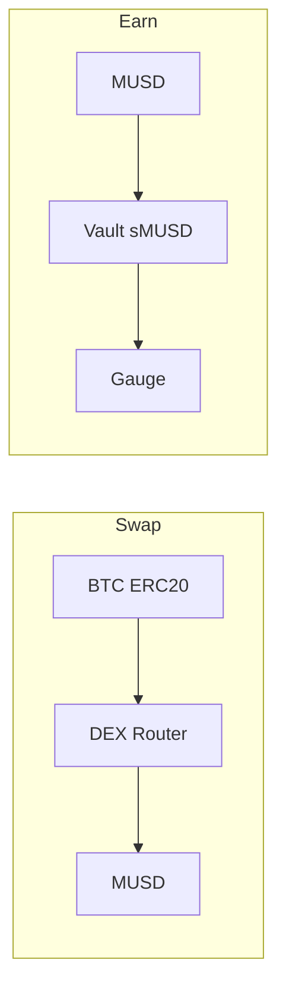

# Smart contract & router plan — Mezo testnet (Swap + Earn)

This document **records what the SnapZo web app does on-chain today** for **DEX swaps** and **MUSD / sMUSD earn**, and outlines a **future hub contract or router** that could automate or batch those operations behind a single user approval or signature.

**Chain:** Mezo Testnet, **chain ID `31611`**.  
**RPC / explorer:** `https://rpc.test.mezo.org`, `https://explorer.test.mezo.org`.

---

## Part A — Record of implemented behavior (frontend)

### A.1 Routes and UI entry points

| Route | Component | Purpose |
|-------|-----------|---------|
| `/swap` | `web/src/components/momento/swap-view.tsx` | BTC ERC-20 ↔ MUSD swap via DEX router |
| `/earn` | `web/src/components/momento/earn-view.tsx` | MUSD vault deposit/redeem + gauge stake/unstake + claim |

**Navigation:** bottom nav (Swap, Earn), wallet menu links (`wallet-header-menu.tsx`).

### A.2 Swap — on-chain facts

**References**

- Successful swap (router + path): [tx `0x22d0d5…`](https://explorer.test.mezo.org/tx/0x22d0d5083ca9a7577c22174d0b3ebc0a133935fc9846a35c6a7e5ab27e606c8b)

**Constants** (`web/src/lib/constants/mezo-dex.ts`)

| Symbol | Address | Role |
|--------|---------|------|
| `MEZO_SWAP_ROUTER` | `0xd245bec6836d85e159763a5d2bfce7cbc3488e03` | Solidly-style router |
| `MEZO_BTC_ERC20` | `0x7b7c000000000000000000000000000000000000` | Router “BTC” **ERC-20** (18 decimals), **not** native gas BTC |
| `MEZO_DEX_FACTORY` | `0x4947243cc818b627a5d06d14c4ece7398a23ce1a` | Factory in route tuple |
| `MUSD` | `0x118917a40FAF1CD7a13dB0Ef56C86De7973Ac503` (env override) | From `musd.ts` |

**Route tuple** (per hop): `(from, to, stable, factory)` with `stable = false` for this pair.

- **BTC → MUSD:** `(MEZO_BTC_ERC20, MUSD, false, MEZO_DEX_FACTORY)`
- **MUSD → BTC:** `(MUSD, MEZO_BTC_ERC20, false, MEZO_DEX_FACTORY)`

**Router functions used in the app**

1. **`getAmountsOut(uint256 amountIn, tuple[] routes)`** — view; used for **price quote without token allowance** (simulating `swapExactTokensForTokens` failed pre-approve because `transferFrom` path reverts without allowance).
2. **`swapExactTokensForTokens(amountIn, amountOutMin, routes, to, deadline)`** — state-changing swap.

**User flow in UI**

1. User enters amount; quote from `getAmountsOut` (last element of returned `uint256[]` = estimated out).
2. If `allowance(tokenIn, router) < amountIn`: `approve(router, maxUint256)` on **tokenIn** (BTC ERC-20 or MUSD), wait for receipt, refetch allowance.
3. `swapExactTokensForTokens` with `amountOutMin = 0` in current demo (no slippage protection — documented in UI).

**Important product note:** users need **router BTC ERC-20 balance** for the BTC side; **native BTC** is primarily **gas**.

### A.3 Earn — on-chain facts

**References**

| Action | Example tx |
|--------|------------|
| MUSD → vault (mint sMUSD) | [0xb1cb7c8f…](https://explorer.test.mezo.org/tx/0xb1cb7c8f8c7c745ba403fe741755f57a209266b717bc098a85c702d9b2ee15e5) |
| Stake sMUSD in gauge | [0x06802b6e…](https://explorer.test.mezo.org/tx/0x06802b6ea45d17fdbaa2d8a1769d1c06fa172d7f6f4ab45200dbcc0174785023) |
| Failed claim (`getReward()` no args) | [0x34c4bc1f…](https://explorer.test.mezo.org/tx/0x34c4bc1f156eacbaccf5d235ebc2ba7ca5753ba2bdbbd2107a771c2c6c81bdb8) |

**Constants** (`web/src/lib/constants/mezo-earn.ts`)

| Symbol | Address | Role |
|--------|---------|------|
| `MEZO_MUSD_VAULT` | `0x6f461c68b2c5492c0f5ccec5a264d692aa7a8e16` | ERC-20 **sMUSD** share token + `deposit` / `withdraw` |
| `MEZO_SMUSD_GAUGE` | `0xa6972f35550717280f2538ea77638b29073e3f07` | Gauge: stake / unstake / rewards |

**Vault**

- **`deposit(uint256)`** — selector `0xb6b55f25`: pull MUSD, mint sMUSD to `msg.sender` (pattern from reference tx).
- **`withdraw(uint256)`** — burn wallet sMUSD, return MUSD (app uses this for “redeem”; user must hold shares in **wallet**, not only staked in gauge).
- **ERC-20:** `balanceOf`, `totalSupply`, `decimals` (18), `approve` / `allowance` for spenders.

**Gauge**

- **`deposit(uint256 amount, address receiver)`** — selector `0x6e553f65`: stake sMUSD; receiver is user in reference tx.
- **`withdraw(uint256)`** — unstake to wallet.
- **`earned(address)`** — pending rewards (raw units).
- **`getReward(address account)`** — **must** pass account; parameterless **`getReward()`** (`0x3d18b912`) **reverts** on this deployment.

**User flows in UI**

1. **Deposit MUSD:** `approve(MUSD → vault)` if needed → `vault.deposit(amount)`.
2. **Stake sMUSD:** `approve(sMUSD → gauge)` if needed → `gauge.deposit(amount, user)`.
3. **Unstake:** `gauge.withdraw(amount)`.
4. **Redeem MUSD:** `vault.withdraw(amount)` (wallet sMUSD only).
5. **Claim:** `gauge.getReward(user)`.
6. **Add sMUSD:** `wallet_watchAsset` (wallet UX only).

**UI layout (current):** compact balance strip, **Vault** / **Gauge** tabs, single-row amount + Max + action; footer line with supply + explorer links + reference txs.

---

## Part B — Plan for a hub smart contract / “router”

### B.1 Goals

1. **Reduce user transactions** — combine approve + swap, or approve + deposit + stake, where safe.
2. **Single entrypoint** — e.g. `MezoZap` / `SnapZoRouter` with explicit actions: `zapSwapBtcToMusd`, `zapDepositAndStake`, `zapUnstakeAndRedeem`, etc.
3. **Optional meta-tx / relayer** — same intent as today’s UI but `msg.sender` is hub; user signs **EIP-712** permit or approves hub once (`Permit2` or infinite approve to hub).
4. **Slippage / min-out** — hub enforces `amountOutMin` on swaps (unlike current UI demo with `0`).
5. **Upgradeability** — only if required; prefer immutable + new deployment for hackathon clarity.

### B.2 High-level architecture options

| Option | Description | Pros | Cons |
|--------|-------------|------|------|
| **1. Thin Zap contract** | User approves tokens **to Zap**; Zap `transferFrom` then `call`s router / vault / gauge; tokens never rest long in Zap | Clear custody model | Still 1–2 txs unless Permit2 |
| **2. Delegate / multicall** | User keeps approvals on existing contracts; Zap only encodes batch **via** multicall3 / router — limited if router has no multicall | Minimal new trust | May not reduce approvals |
| **3. Permit2 + Universal Router pattern** | One-time Permit2 signature; executor pulls and routes | Best UX | Higher implementation / audit surface |

**Recommendation for first iteration:** **Thin Zap (Option 1)** with **explicit per-action methods** and **documented address list** (router, vault, gauge, MUSD, BTC ERC-20, factory) as **immutable constructor args** or **governable** allowlist (two-step timelock if production).

### B.3 Operations to support (mapping from current UI)

| Zap method (illustrative) | Underlying calls (order) | Approvals required |
|---------------------------|---------------------------|---------------------|
| `swapBtcToMusd(user, amountIn, minOut, deadline)` | `BTC.transferFrom` → `router.swapExactTokensForTokens` | User → Zap for BTC |
| `swapMusdToBtc(...)` | `MUSD.transferFrom` → swap | User → Zap for MUSD |
| `depositMusdAndStake(user, musdAmount)` | `MUSD.transferFrom` → `vault.deposit` → `sMUSD.approve(gauge)` → `gauge.deposit(shares, user)` | MUSD → Zap; may need Zap to hold sMUSD briefly between vault mint and gauge stake |
| `unstakeAndRedeem(user, shareAmount)` | `gauge.withdraw` (Zap must hold gauge accounting — **see risk**) | **Problem:** staked balance is on **user** in gauge; Zap cannot `withdraw` user’s stake unless user transfers **gauge LP** differently |

**Critical design note:** Today the **gauge `balanceOf` is the user’s staked position**. Unstake is `gauge.withdraw(amount)` from **msg.sender**. So a Zap **cannot** unstake on behalf of a user unless:

- the gauge supports **`withdrawFor` / `withdraw(address owner, …)`** (this one does not in our ABI), or  
- the user **approves Zap on a wrapper** (not applicable here), or  
- only **deposit paths** are batched from Zap (user still unstakes/redeems themselves), or  
- gauge is upgraded / different contract with delegation (out of scope).

**Practical scope v1 Zap**

- **Fully automatable:** `swap*` (with user approve Zap), **`depositMusdAndStake`** (Zap receives MUSD, deposits, receives sMUSD, approves gauge, stakes to **user** as receiver — matches `deposit(amount, receiver)`).
- **Partially automatable:** `claimReward` — only if gauge adds `getRewardFor` or Zap is `receiver` of rewards (verify reward distribution); current **`getReward(address)`** pays **that address** — need on-chain read of whether rewards go to `msg.sender` or `account` param target.
- **User must still sign:** `unstake` / `redeem` **unless** new gauge methods exist.

Verify **`getReward(account)`** semantics on testnet: if rewards accrue to `account` and tokens are transferred to `account`, Zap could call `getReward(user)` with `msg.sender == Zap` — **only if** the gauge credits Zap vs user; **this must be verified** before automating claim.

### B.4 Security checklist

- Reentrancy guards on any ETH/token receive + external call.
- **Pull pattern:** only `transferFrom` from `msg.sender` or permit-based allowance to Zap.
- **Min-out** on all swaps; revert if `amountOut < minOut`.
- **Deadline** on swaps.
- **No infinite delegatecall** to user-supplied addresses; fixed router/vault/gauge addresses.
- **Allowlist** external targets if any upgrade path.
- **Events** per zap for indexing (`ZapSwap`, `ZapDepositStake`, …).

### B.5 Implementation phases

| Phase | Deliverable | Success criteria |
|-------|-------------|------------------|
| **P0** | Freeze **addresses + ABIs** in this doc and in `contracts/` README | Matches mainnet/testnet deployment used by app |
| **P1** | Foundry project: interfaces for Router, Vault, Gauge, IERC20 | `forge build` |
| **P2** | `MezoEarnZap`: `depositAndStake(musdAmount, minSharesOut?)` | Fork test: MUSD → sMUSD → gauge balance increases for **user** |
| **P3** | `MezoSwapZap` or reuse router with Zap as `to` then forward to user | Fork test: BTC → MUSD to user with slippage |
| **P4** | Optional **Permit2** or ERC-2612 permits on MUSD if available | One-tx UX where permits exist |
| **P5** | Wire frontend: “Zap via contract” toggle calling Zap instead of direct calls | Same balances as manual path on fork |

### B.6 Open questions (before mainnet)

1. Does **`getReward(address)`** send reward tokens to **`address`** or to **`msg.sender`**? (Determines if Zap can claim for user.)
2. Is **`vault.withdraw`** always “redeem n shares” or could it mean “withdraw n assets” on other versions? (Match ERC4626 naming if they migrate.)
3. **Governance:** who sets router/vault/gauge if Mezo upgrades addresses?
4. **MUSD permit:** does testnet MUSD support `permit` (EIP-2612)?

---

## Part C — File index (implementation source of truth)

| Area | File |
|------|------|
| DEX constants + routes + router ABI | `web/src/lib/constants/mezo-dex.ts` |
| Earn constants + vault/gauge ABI | `web/src/lib/constants/mezo-earn.ts` |
| MUSD address + balance ABI | `web/src/lib/constants/musd.ts` |
| Swap UI | `web/src/components/momento/swap-view.tsx` |
| Earn UI | `web/src/components/momento/earn-view.tsx` |
| Rich toasts (tx links) | `web/src/components/providers/snapzo-toast-provider.tsx` |
| Chain definition | `web/src/lib/chains/mezo-testnet.ts` |

---

## Part D — Product spec (Q&A): **SNAP pooled vault hub** (authoritative)

This section **supersedes Part B** for the contract you are designing now: a **pooled strategy hub** that mints/burns **SNAP** (receipt shares), **not** a user-facing swap router. **Part A** remains the reference for what the current web UI calls on-chain today.

### D.1 Scope (in / out)

| In scope | Out of scope (v1) |
|----------|-------------------|
| User **deposits MUSD** into hub; hub **mints SNAP** (fair share math) | **Swap** from this contract (users swap elsewhere) |
| Hub **pools** MUSD → **vault** → **sMUSD** → **gauge stake** (single contract position) | **SnapZo social** payments / other app contracts |
| User **withdraws** via **relayer + signature**: burn **SNAP**, unwind gauge/vault, **MUSD to user** | — |
| **Harvest** reward token; **performance fee** to treasury; **swap reward → MUSD** (testnet: **no min-out**); **restake** into strategy | Production-grade **slippage / MEV** protection (must be added before mainnet) |
| **Whitelisted relayers** (owner-managed) | Open/public relayers |
| **Owner OR relayer** may call harvest/restake | — |
| **Pausable** emergency stop | — |
| **Upgradeable** with **0 timelock** (testnet speed) | Strong timelock (add before mainnet if desired) |
| **Owner updates** router / vault / gauge / reward token addresses **only while paused** | — |
| **Owner-only junk sweep** while paused (denylist: **MUSD, SNAP, rewardToken, sMUSD** if applicable) | Permissionless sweeps |

### D.2 Decisions table

| # | Topic | Decision |
|---|--------|----------|
| 1 | User vs relayer | User **signs intent**; **whitelisted relayer** submits txs and pays gas; value settles **to user** on withdraw |
| 2 | Relayer policy | **Whitelist** 1+ relayer addresses; **only owner** can add/remove |
| 3 | Swaps in this SC | **None** for user swaps; **only** internal **reward token → MUSD** swap on restake path |
| 4 | Strategy | **Pooled** vault + gauge position **owned by hub**; users hold **SNAP** pro-rata |
| 5 | Fairness | **ERC-4626-style** mint/burn: `totalAssets` / `totalSupply` style accounting so **time + restaked rewards** increase value per SNAP |
| 6 | SNAP transferability | **Transferable** ERC-20 (used elsewhere manually / by other contracts) |
| 7 | Pause | **Yes** — pause critical paths |
| 8 | Upgrades | **Upgradeable**; **0 timelock** for v1 testnet |
| 9 | Integrations drift | **Owner may update** router/vault/gauge/reward-token pointers **only while paused** |
| 10 | Deposits | **Relayer-only** entry (user signature) |
| 11 | Withdraws | **Relayer-only** entry (user signature) |
| 12 | Harvest/restake | **Owner OR whitelisted relayer** |
| 13 | Min deposit | **1 MUSD** |
| 14 | TVL cap | **None** |
| 15 | Performance fee | **On harvested rewards**; **owner withdraws anytime**; **max 10%** configurable up to cap |
| 16 | Reward token | **Configurable in hub**; on Mezo testnet **`MEZO_SMUSD_GAUGE.rewardToken()`** reads **`0x7B7c000000000000000000000000000000000001`** (distinct from router “BTC ERC-20” **`0x7b7c…0000`**) |
| 17 | Restake swap safety | **Testnet: accept any** (`amountOutMin = 0`); **must harden** before mainnet |
| 18 | Deployment target | **Testnet first**, architecture supports **mainnet later** |
| 19 | Junk tokens | **Owner sweep when paused** + **denylist** for core tokens |
| 20 | SNAP branding | **Name:** `SnapZo Mezo Share` — **Symbol:** `SNAP` — **Decimals:** `18` |
| 21 | `owner` | **Single EOA** for day one (upgrade to multisig recommended before real TVL) |
| 22 | **MUSD allowance for deposit** | **Baseline: ERC-20 `approve(hub, …)`**. **Optional:** **EIP-2612 `permit` is present** on testnet MUSD (`DOMAIN_SEPARATOR` + `nonces` respond on `0x1189…c503`); safe to add **`permit` + `transferFrom` in one relayer tx** once typed-data domain is wired. |
| 23 | **`getReward(account)` payout** | **Rewards are paid to the `account` argument**, not inferred from `msg.sender` only: on-chain `Transfer` from gauge to **`getReward(account)`** matches **`account`** (see [tx `0xe1bb1943…`](https://explorer.test.mezo.org/tx/0xe1bb194315088e7a7ef44baca8cdddcc9089cb6b4660640baac0055883ae8bcb)). Hub should call **`gauge.getReward(address(hub))`** so **REWARD lands on the hub** (any address may submit the tx). |

### D.3 Verified on-chain (Mezo testnet RPC, 2026-04-17)

| Check | Result |
|--------|--------|
| **`MEZO_SMUSD_GAUGE.rewardToken()`** | **`0x7B7c000000000000000000000000000000000001`** (matches product input) |
| **`getReward(account)` recipient** | **REWARD token `Transfer` `to` equals `account`** in decoded claim tx (sample above). |
| **MUSD EIP-2612** | **`name()`** = `Mezo USD`; **`DOMAIN_SEPARATOR()`** and **`nonces(address)`** succeed → **`permit` is available** for deposit UX. |
| **Router `getAmountsOut` REWARD → MUSD** | **`MEZO_SWAP_ROUTER` + `MEZO_DEX_FACTORY`**: single-hop **volatile** and **stable** both return **`0` MUSD** for `1e18` in (no usable pool / no liquidity for that hop at query time). Two-hop **REWARD (`…0001`) → BTC ERC-20 (`…0000`) → MUSD** also fails on the first hop (`0` mid). **BTC (`…0000`) → MUSD** still quotes a large out (sanity check). |

**Implication:** **restake “swap reward → MUSD” cannot rely on the same router/factory path as BTC↔MUSD until a pool exists** (or Mezo documents a different router/factory for `…0001`). Hub should keep **owner-configured route structs** and treat swap as **best-effort / skip if zero out** on testnet until liquidity exists.

### D.4 Remaining / operational notes

1. **sMUSD** — the gauge’s **`stakingToken()`** is the **vault share token** (`MEZO_MUSD_VAULT`); treat that ERC-20 as **denylisted for junk sweep** whenever it is a core integration token.
2. **Restake router** — re-run `getAmountsOut` / small `eth_call` swap simulation **after** Mezo adds a **REWARD/MUSD** (or **REWARD/BTC/MUSD**) pool, or when official docs list a different **factory**.

---

## Revision history

| Date | Change |
|------|--------|
| 2026-04-16 | Initial document: record Swap + Earn + Zap plan |
| 2026-04-17 | **Part D:** Q&A product spec for SNAP pooled hub; Part B retained as earlier “zap” exploration |
| 2026-04-17 | **Part D row 22:** MUSD — approve baseline; optional EIP-2612 permit after on-chain verification |
| 2026-04-17 | **Part D rows 16, 22–23 + D.3–D.4:** reward token address; `getReward` + MUSD permit + router quotes verified via RPC |
| 2026-04-17 | **Part E:** Foundry `contracts/` — `SnapZoHub` (UUPS) + `SnapToken`, tests, deploy script |
| 2026-04-18 | **Part F:** Q&A product spec for SNAP social economy (tips, unlocks, paid replies, relayer, UUPS) |
| 2026-04-18 | **Part F:** paid reply stake = global `replyStakeAmount` (same pattern as `likeTipAmount`) |
| 2026-04-18 | **Part E:** `SnapZoSocial.sol` (UUPS) + tests + `DeploySnapZoSocial.s.sol` |

## Part E — Implemented contracts (`contracts/`)

| Item | Location |
|------|----------|
| Hub (UUPS) + EIP-712 deposit/withdraw, harvest/fee, restake (swap skipped if quote `0`) | `contracts/src/SnapZoHub.sol` |
| SNAP ERC-20 (hub-only mint/burn) | `contracts/src/SnapToken.sol` |
| Social economy (UUPS): tips, unlocks, reply escrow — EIP-712, relayer-only | `contracts/src/SnapZoSocial.sol` |
| Mezo-facing interfaces | `contracts/src/interfaces/IMezo.sol` |
| Foundry tests (mocks) | `contracts/test/SnapZoHub.t.sol`, `contracts/test/SnapZoSocial.t.sol`, `contracts/test/Mocks.sol` |
| Deploy script + env | `contracts/script/DeploySnapZoHub.s.sol`, `contracts/script/DeploySnapZoSocial.s.sol`, `contracts/README.md` |

Build / test: `cd contracts && forge build && forge test`.

---

## Part F — Product spec (Q&A): **SNAP social economy** (tips, unlocks, paid replies)

**Status:** agreed in product Q&A (2026-04-18). **Next implementation:** single **upgradeable** contract (working name: e.g. `SnapZoSocial`) that moves **SNAP only**, integrates with existing **`SnapToken`** + relayer pattern.

### F.0 DB vs chain (important)

- **Posting stays off-chain:** creators do **not** send a tx to set price; the **app DB** is the UX source of truth for “what unlock costs” and feed metadata.
- **Security still requires a binding amount on-chain:** when a user **signs** a gasless unlock, the **EIP-712 payload must include the exact `amount` (and `postId`, `creator`, `deadline`, `nonce`, …)** that the UI read from the DB at sign time. The contract then **`transferFrom`s exactly that amount** and reverts if the signature or amount does not match. So: **no on-chain price registry**, but **no underpay unlock** either — the **signature**, not a later relayer choice, fixes the price for that action.
- Same pattern wherever a user could otherwise cheat: **signed fields == enforced transfer**.

### F.1 Scope

| In | Out (v1) |
|----|-----------|
| **Tip (like)** — SNAP from fan → **through contract** → creator | MUSD |
| **Unlock** — SNAP from fan → **through contract** → creator; **exact amount** from signed intent (DB-backed at sign time) | On-chain `setPrice(postId)` registry (not required) |
| **Paid reply** — payer locks SNAP in contract; **24h**; creator **fulfills** with a **second signed tx** (no payment); else payer **refunds** | Protocol fee (**none** for v1) |
| **Relayer-only** execution paths (whitelist like hub) | Public/open relayers |
| **UUPS upgradeable** | — |
| **Identifiers:** global unique **`postId`**; always pass **`creator`** alongside for safety | — |

### F.2 Roles

| Role | Responsibility |
|------|------------------|
| **Fan / payer** | Signs EIP-712 for tip, unlock, or reply-deposit |
| **Relayer** | Submits txs, pays gas; **must** be allowlisted |
| **Creator** | Signs EIP-712 **fulfill** for paid reply (no SNAP paid; calldata binds **`commentId`** for DB correlation) |
| **Owner** | Relayer list, upgrades, **`likeTipAmount`** and **`replyStakeAmount`** (global, set/edit on-chain — same pattern for likes and paid replies) |

### F.3 Like / tip (fixed amount on-chain)

- **Decision:** tip amount is **configured on the SC** (owner **set / edit**), e.g. global `likeTipAmount` (extend later to per-post if needed).
- **User signs** gasless data including **`postId`**, **`creator`**, **`nonce`**, **`deadline`**. Contract reads **`likeTipAmount`** from storage and pulls that much SNAP (or require signature to include amount and match storage — implementation detail).
- **Flow:** `transferFrom(tipper → this, amount)` → `transfer(creator, amount)`, **emit event** with `postId`, `creator`, `tipper`, `amount` for indexer/DB.

### F.4 Unlock

- **DB** drives what the UI shows; **user signs** EIP-712 including **`unlockAmount`**, **`postId`**, **`creator`**, **`nonce`**, **`deadline`**.
- Contract enforces **`transferFrom` == `unlockAmount`** and valid signature; forwards SNAP to **creator**, emits event.

### F.5 Paid reply (escrow + creator fulfill)

- **Stake amount:** **Single global `replyStakeAmount`** on the SC (owner **set / edit**), **same model as likes** — not per-request in the signature.
- **Payer** signs EIP-712 to **open** a reply request with **`postId`**, **`creator`**, **`nonce`**, **`deadline`** (no variable amount field). Contract pulls **`replyStakeAmount`** from storage into escrow (same pattern as **`likeTipAmount`** for tips).
- **`requestId`:** **`keccak256(abi.encode(chainId, contractAddress, postId, creator, requester, nonceRequest))`** with **`nonceRequest`** = **per-requester** nonce **incremented in the contract** at deposit (unique, replay-safe). (This is the “best default” for **E**.)
- **`deadlineReply`:** store **`block.timestamp + 24 hours`** at deposit.
- **Creator fulfill:** creator signs **`FulfillReply(requestId, commentId, deadline)`** — relayer submits; contract releases escrowed **`replyStakeAmount`** to **creator**; event includes **`commentId`** for DB.
- **Refund:** after 24h if not fulfilled, **requester** signs **`RefundReply(requestId)`** (or equivalent); **`replyStakeAmount`** returned to requester.

### F.6 SNAP / hub integration notes

- Moves use **SNAP** `transferFrom` / `transfer`. **`SnapZoHub`** updates **MEZO reward debt** on SNAP transfer via **`snapTransferHook`** — escrow **holds** SNAP briefly; hooks still apply on each transfer.

### F.7 Fees & upgrades

| Topic | Decision |
|-------|----------|
| **Protocol fee** | **0%** (v1) |
| **Contract count** | **One** upgradeable contract |
| **Upgrade pattern** | **UUPS** (align with `SnapZoHub`) |

### F.8 Minor choices left to implementation

1. **Like / reply stake:** amount enforced from **storage only** vs **also duplicated in signature** for extra safety — storage-only means fewer fields; users mid-sign must handle owner changing **`likeTipAmount`** / **`replyStakeAmount`** (same tradeoff for both globals).

**Locked for v1:** paid reply uses **global `replyStakeAmount`** (not variable per request).
